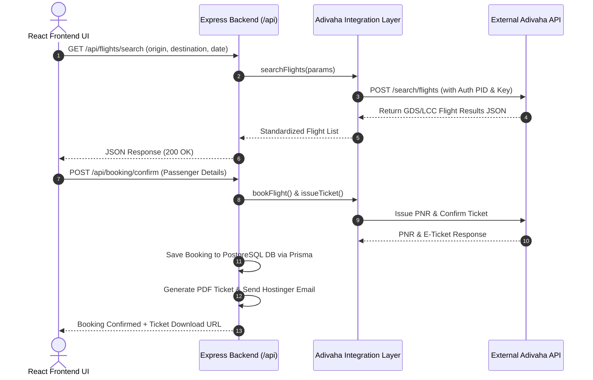

# 🛡️ FlyAnyTrip Backend Integration & System Architecture Guide

This document provides a comprehensive technical manual for the **FlyAnyTrip Backend**, documenting the integration between `ANYTRIP 3.0/flyanytrip-backend` and `FLYANYTRIP MILAN/backend`, Adivaha Travel API integration, Prisma PostgreSQL database ORM, Razorpay payment gateway, and Hostinger SMTP e-ticket dispatchers.

---

## 📌 1. Project Overview & Tech Stack

| Module | Technology | Purpose / Role |
| :--- | :--- | :--- |
| **Server Framework** | **Node.js + Express 5** | RESTful API server with Helmet security, CORS preflight handling, and rate limiting. |
| **Database & ORM** | **PostgreSQL + Prisma 7 ORM** | Relational database schema managing users, bookings, passengers, coupons, and analytics. |
| **Travel API Provider** | **Adivaha Travel API** | Live GDS/LCC flight search, fare rules, seatmap visual layout, and hotel search/room booking engine. |
| **Payment Gateway** | **Razorpay API** | Order creation, auto-capture, and HMAC SHA256 payment signature verification. |
| **Email Service** | **Hostinger SMTP + Nodemailer** | Automated email dispatch of PDF tickets and hotel booking vouchers. |
| **PDF Generation** | **Pdfmake** | Dynamic generation of electronic tickets and customer invoices. |

---

## 📂 2. Backend Folder Breakdown (`m:\FLYANYTRIP FINAL UI\FLYANYTRIP MILAN\backend`)

```
backend/
├── 📄 server.js                   # Entry point (Express app initialization, CORS, global error handling)
├── 📄 package.json                # Server dependencies (@prisma/client, express, razorpay, nodemailer, pdfmake)
├── 📄 vercel.json                 # Serverless deployment configuration for Vercel
├── 📄 .env                        # Environment credentials (DB URL, Adivaha Keys, Razorpay Keys, SMTP credentials)
├── 📄 check_db.js                 # Database connection testing script
├── 📄 test_adivaha.js             # Adivaha API integration diagnostic script
│
├── 📁 config/                     # Configuration Singletons
│   ├── db.js                      # Legacy database connection helper
│   └── prisma.js                  # Shared Prisma client instance with @prisma/adapter-pg
│
├── 📁 prisma/                     # Database Schema & Migrations
│   └── schema.prisma              # PostgreSQL tables & relations (users, bookings, flight_bookings, etc.)
│
├── 📁 integrations/               # Third-Party API Proxies
│   └── 📁 adivaha/
│       ├── adivaha.service.js       # Flight API proxy (Search, Seatmap, Fare Rules, Book, Issue Ticket)
│       └── adivaha.hotel.service.js # Hotel API proxy (Search, Details, Room rates, Cancellation policy)
│
├── 📁 controllers/                # Business Logic Handlers
│   ├── flight.controller.js       # Flight search, fare quote, SSR, calendar fare
│   ├── hotel.controller.js        # Hotel search, details, room rate selection
│   ├── booking.controller.js      # Booking orchestration, PNR issuance, invoice generation
│   ├── flightBooking.controller.js# Flight booking retrieval & status queries
│   ├── payment.controller.js      # Razorpay order creation & signature validation
│   ├── coupon.controller.js       # Promo code application & validation
│   ├── traveller.controller.js    # Co-travellers passenger profile management
│   ├── user.controller.js         # Customer profile management
│   └── userStats.controller.js    # Dashboard analytics and loyalty calculation
│
├── 📁 routes/                     # Express Router Mapping
│   ├── flight.routes.js           # /api/flights/*
│   ├── hotel.routes.js            # /api/hotels/*
│   ├── booking.routes.js          # /api/booking/*
│   ├── payment.routes.js          # /api/payment/*
│   ├── coupon.routes.js           # /api/coupons/*
│   ├── users.routes.js            # /api/v2/users/*
│   ├── travellers.routes.js       # /api/v2/travellers/*
│   ├── bookings.routes.js         # /api/v2/bookings/*
│   ├── flightBookings.routes.js   # /api/v2/flight-bookings/*
│   └── userStats.routes.js        # /api/v2/user-stats/*
│
├── 📁 services/                   # Business Services
│   ├── email.service.js           # Nodemailer HTML email voucher sender
│   ├── pdf.service.js             # Pdfmake e-ticket generator
│   ├── booking.service.js         # Booking persistence helper
│   ├── user.service.js            # User management operations
│   └── traveller.service.js       # Traveller persistence helper
│
├── 📁 middlewares/                # Express Middlewares
│   └── auth.middleware.js         # JWT Token validation & role checks
│
└── 📁 utils/                      # Utilities
    ├── apiResponse.js             # Standardized JSON response wrapper
    └── logger.js                  # Logging helper
```

---

## 🔄 3. Folder Synchronization Audit (`ANYTRIP 3.0` vs `backend`)

All components between `ANYTRIP 3.0/flyanytrip-backend` and `FLYANYTRIP MILAN/backend` are **100% synchronized**:

| Component | `ANYTRIP 3.0/flyanytrip-backend` | `FLYANYTRIP MILAN/backend` | Sync Status |
| :--- | :--- | :--- | :---: |
| **Adivaha Integration** | `adivaha.service.js`<br/>`adivaha.hotel.service.js` | `adivaha.service.js`<br/>`adivaha.hotel.service.js` | ✅ Synchronized |
| **Controllers (10)** | `flight`, `hotel`, `booking`, `payment`, `coupon`, `user`, `userStats`, `traveller`, `bookingsV2`, `flightBooking` | `flight`, `hotel`, `booking`, `payment`, `coupon`, `user`, `userStats`, `traveller`, `bookingsV2`, `flightBooking` | ✅ Synchronized |
| **Routes (10)** | `flight`, `hotel`, `booking`, `payment`, `coupon`, `users`, `userStats`, `travellers`, `bookings`, `flightBookings` | `flight`, `hotel`, `booking`, `payment`, `coupon`, `users`, `userStats`, `travellers`, `bookings`, `flightBookings` | ✅ Synchronized |
| **Services (7)** | `email`, `pdf`, `booking`, `user`, `userStats`, `traveller`, `flightBooking` | `email`, `pdf`, `booking`, `user`, `userStats`, `traveller`, `flightBooking` | ✅ Synchronized |
| **Database Schema** | `prisma/schema.prisma` | `prisma/schema.prisma` | ✅ Synchronized |
| **Prisma Connection** | `config/prisma.js` | `config/prisma.js` | ✅ Synchronized |

---

## ✈️ 4. Adivaha API Integration Workflow

The backend proxies requests between the React UI and Adivaha Travel API servers:



---

## 🗄️ 5. PostgreSQL Database Schema Models

The database models in `prisma/schema.prisma` store complete travel records:

- **`users`**: Customer accounts (`email`, `phone`, `first_name`, `last_name`, `password_hash`).
- **`bookings`**: Parent transaction record (`booking_id`, `user_id`, `booking_type`, `status`, `total_amount`).
- **`flight_bookings`**: Flight itinerary (`pnr`, `provider_order_id`, `airline_code`, `flight_number`, `origin_airport`, `destination_airport`, `departure_date`, `offered_fare`).
- **`flight_booking_passengers`**: Passenger column mapping (`first_name`, `last_name`, `passport_no`, `seat_number`, `meal_name`, `baggage_weight`).
- **`hotel_bookings`**: Hotel reservation details (`hotel_id`, `hotel_name`, `check_in`, `check_out`, `rooms`, `rate_key`, `provider_reference`).
- **`co_travellers` / `travellers`**: Saved frequent flyers list for auto-filling passenger fields.

---

## 💳 6. Razorpay Payment & Hostinger SMTP Verification

### Razorpay Integration (`controllers/payment.controller.js`)
- **Order Creation**: `POST /api/payment/create-order` creates a Razorpay order ID.
- **Signature Verification**: `POST /api/payment/verify` computes `HMAC-SHA256(order_id + "|" + payment_id, secret)` to validate payment authenticity before issuing tickets.
- **Config Endpoint**: `GET /api/payment/config` dynamically returns the public Razorpay Key ID (`rzp_test_RH0I6LBnmc0Ziz`).

### Hostinger SMTP Email Integration (`services/email.service.js`)
- **Host**: `smtp.hostinger.com` (Port `465`, SSL `true`)
- **Email Dispatch**: Sends HTML confirmation emails with attached PDF tickets (`FlyAnyTrip_Invoice_[PNR].pdf`).

---

## 🛠️ 7. Commands to Run & Verify Backend

### 1. Run Diagnostic Tests
```bash
# Test Adivaha API Search & Fare Calendar
node test_adivaha.js

# Test Live Backend Endpoints (Health check, Payment config, Flight search)
node scratch/test_live_backend.js
```

### 2. Start Backend Server
```bash
cd backend
npm install
npm run dev
# Server will start on http://localhost:5000
```

---
*Documentation compiled for FlyAnyTrip Milan Backend Architecture.*
