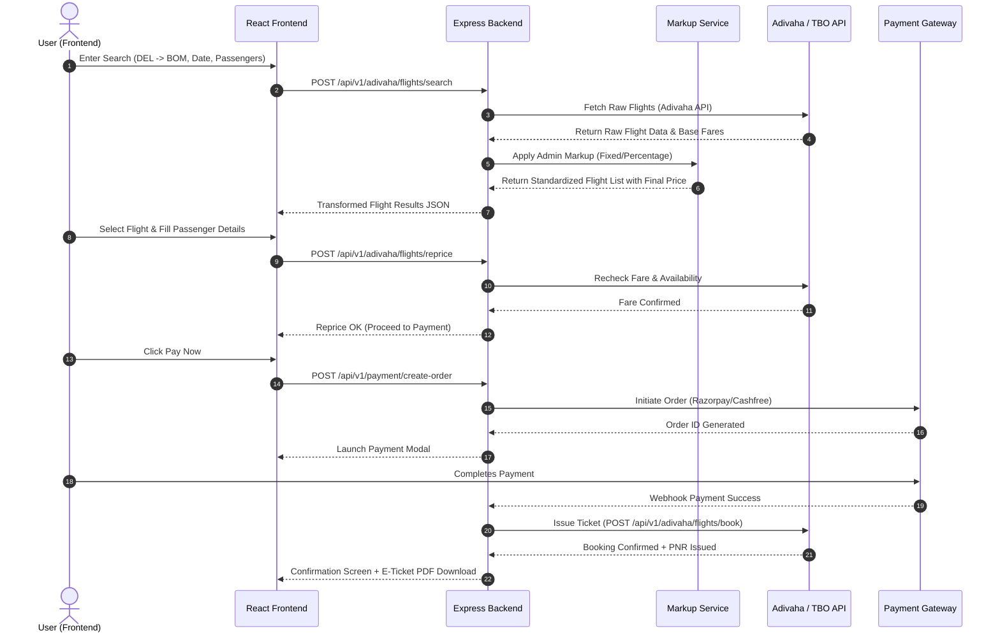

# 🚀 FlyAnyTrip (ANYTRIP 3.0) — Codebase Architecture & Technical Roadmap

Yeh document **FlyAnyTrip** project ka complete, detailed, aur comprehensive technical guide hai. Isme frontend, backend, folder structure, API integrations (Adivaha & TBO), dynamic pricing logic, aur feature breakdown ki har ek detail tabular aur structured format me cover ki gayi hai.

---

## 📁 1. Project Folder Structure Overview

FlyAnyTrip project ka full tree structure Neeche diya gaya hai:

```text
FLYANYTRIP MILAN/
│
├── ANYTRIP 3.0/                            # Core Production Codebase (v3.0 Architecture)
│   ├── flyanytrip-backend/                 # Node.js + Express + Prisma Backend
│   │   ├── config/                         # DB & App Configurations (Prisma Client, Env setup)
│   │   ├── controllers/                    # Route Handlers & Business Request logic
│   │   │   ├── adivahaFlight.controller.js # Adivaha Flight API controller (Search, Book, Rules)
│   │   │   ├── flight.controller.js        # Internal/TBO Flight controller
│   │   │   ├── hotel.controller.js         # Hotel search & booking logic
│   │   │   ├── markup.controller.js        # Admin B2C/B2B dynamic pricing & markup logic
│   │   │   ├── payment.controller.js       # Razorpay / Cashfree Payment integration
│   │   │   └── user.controller.js          # Authentication & User Management
│   │   ├── integrations/                   # 3rd Party Flight & Hotel API Connectors
│   │   │   ├── adivaha/                    # Adivaha Flight API Integration Layer
│   │   │   │   ├── adivahaClient.js        # HTTP client & signature generator
│   │   │   │   └── adivahaTransformer.js   # Raw API to FlyAnyTrip standard schema adapter
│   │   │   └── tbo/                        # TBO (Travel Boutique Online) API Integration
│   │   ├── middlewares/                    # Express Middlewares
│   │   │   ├── auth.middleware.js          # JWT Authentication & Admin RBAC check
│   │   │   └── errorHandler.middleware.js  # Centralized Error & Exception Handler
│   │   ├── prisma/                         # Database ORM & Schemas
│   │   │   └── schema.prisma               # PostgreSQL Database Schema Models
│   │   ├── repositories/                   # Data Access Layer (Prisma Queries)
│   │   ├── routes/                         # API Endpoint Definitions
│   │   │   ├── adivahaFlight.routes.js     # Flight Endpoints (/api/v1/adivaha/flights/*)
│   │   │   ├── flight.routes.js            # Standard Flight Endpoints
│   │   │   ├── hotel.routes.js             # Hotel Endpoints (/api/v1/hotels/*)
│   │   │   ├── markup.routes.js            # Admin Markup Config Routes
│   │   │   ├── payment.routes.js           # Payment Gateway Webhooks & Order Routes
│   │   │   └── user.routes.js             # Auth & Profile Routes
│   │   ├── services/                       # Core Core Business Logic
│   │   │   ├── flight.service.js           # Flight Aggregation & Fare Calculation Service
│   │   │   ├── hotel.service.js            # Hotel Aggregation Service
│   │   │   └── markup.service.js           # Dynamic Markup Application Logic
│   │   ├── utils/                          # Helper Functions, Logger, Custom Errors
│   │   └── server.js                       # Express Server Entry Point & Initialization
│   │
│   └── flyanytrip-frontend/                # React.js + Vite + Tailwind CSS Frontend
│       ├── public/                         # Static Assets (Logos, Icons, Banners)
│       └── src/                            # Source Code
│           ├── assets/                     # Images, Vectors, Animations (Lottie)
│           ├── components/                 # Reusable Shared UI Components (Navbar, Footer, Modals)
│           ├── context/                    # React Context (AuthContext, BookingContext, CurrencyContext)
│           ├── features/                   # Domain-Driven Feature Modules
│           │   ├── common/                 # Common Feature Components
│           │   ├── flights/                # Flight Module (Search, Matrix, Filters, Seat Map, Review)
│           │   │   ├── components/         # Flight Card, Airline Filter, Fare Breakdown, SeatPicker
│           │   │   ├── pages/              # FlightSearchPage, FlightDetailsPage, FlightBookingPage
│           │   │   └── hooks/              # useFlightSearch, useFareRules, useBookFlight
│           │   ├── hotels/                 # Hotel Module (Search, Room Selection, Guest Details)
│           │   │   ├── components/         # HotelCard, RoomCard, RatingFilter, AmenityFilter
│           │   │   ├── pages/              # HotelSearchPage, HotelDetailsPage, HotelCheckoutPage
│           │   │   └── hooks/              # useHotelSearch, useHotelDetails
│           │   ├── tours/                  # Holiday Package Module
│           │   └── visa/                   # Visa Processing & Application Module
│           ├── hooks/                      # Global Custom React Hooks
│           ├── layouts/                    # MainLayout, AuthLayout, DashboardLayout
│           ├── pages/                      # Top-level Page Views (Home, Profile, Bookings, Support)
│           ├── routes/                     # React Router v6 Config & Guarded Routes
│           ├── services/                   # Frontend API Services (Axios HTTP client)
│           │   ├── adivahaApi.js           # Adivaha Flight API Call Services
│           │   ├── flightApi.js            # Flight Backend API Client
│           │   ├── hotelApi.js             # Hotel Backend API Client
│           │   └── paymentApi.js           # Payment Gateway Client
│           ├── utils/                      # Date Formatters, Price Calculators, Validators
│           ├── App.jsx                     # Core App Routing & Context Provider Setup
│           └── main.jsx                    # React Virtual DOM Mounting Entry
│
└── FLYANYTRIP-UI-/                         # Secondary/Legacy UI Sandbox (Vite Server Active)
```

---

## 🛠️ 2. Backend Deep Dive (`flyanytrip-backend`)

Backend ko Node.js + Express.js modular clean architecture standard pe design kiya gaya hai.

### Key Directories & Responsibilities:

| Directory / File | Description | Responsibility |
| :--- | :--- | :--- |
| `server.js` | Main Application Bootstrap | Express server start karta hai, CORS configure karta hai, DB connection initialize karta hai. |
| `config/` | Environment & Database Config | Prisma Client instance manage karta hai and Env variables validate karta hai. |
| `integrations/adivaha/` | Adivaha Third-Party Connector | Adivaha Flight API se live communication karta hai, raw response parse and transform karta hai. |
| `integrations/tbo/` | TBO API Connector | TBO Flight & Hotel API integrations. |
| `services/` | Business & Calculation Engine | Search results merge karna, admin markups calculate karna, validation checks. |
| `controllers/` | Request/Response Handlers | Front-end HTTP requests accept karta hai, Services ko invoke karta hai aur JSON response send karta hai. |
| `routes/` | API Routing Layer | Endpoints path define karta hai aur Auth/Role middlewares apply karta hai. |
| `prisma/schema.prisma` | PostgreSQL Database Schema | Users, Bookings, Transactions, MarkupRules, Flights, Hotels models defines. |

---

## 💻 3. Frontend Deep Dive (`flyanytrip-frontend`)

Frontend modern **React 18 + Vite** par setup hai. Component architecture Domain-Driven (`src/features/`) structured hai.

### Module Breakdown:

```text
src/
├── features/
│   ├── flights/              # Complete Flight Booking Journey
│   │   ├── components/       # Flight Card, Airline Filter, Stop Filter, Seat Picker
│   │   ├── pages/            # Search Results, Review Booking, Ticket Download
│   │   └── hooks/            # Custom Hooks for live flight polling & filter logic
│   ├── hotels/               # Hotel Booking Module
│   │   ├── components/       # Hotel Card, Room Selector, Amenity Filters
│   │   ├── pages/            # Search Listing, Property Details, Guest Form
│   │   └── hooks/            # Hotel search & filter management
│   ├── tours/                # Custom Holiday & Tour Package Booking
│   └── visa/                 # Visa Application & Document Upload System
```

---

## ✈️ 4. Flight Section Workflow (Full Journey)

Flight search and booking flow execution architecture:



---

## 🏨 5. Hotel & Other Modules (Hotel, Visa, Tours)

### 1. Hotel Section Architecture:
* **Search Engine**: Location-based / City ID search with Date range & Room configuration.
* **Property Details**: High-resolution gallery, amenities list, policies, and room cancellation rules.
* **Room Selector**: Multi-room options (Deluxe, Executive, Suite) with breakfast inclusion tags.
* **Booking Confirmation**: Instant voucher generation with confirmation number.

### 2. Visa Processing System:
* **Country Selection**: Requirement checklist according to passport nationality.
* **Document Upload**: Passport scan, photo, and bank statement verification system.
* **Status Tracker**: Live application lifecycle tracking (Pending -> Under Review -> Approved -> Downloaded).

### 3. Holiday Packages (Tours):
* **Custom Itinerary**: Day-by-day activity breakdown with inclusion/exclusion filters.
* **Enquiry & Direct Booking**: Instant query submission for tailored group tours.

---

## 📊 6. Database & Dynamic Pricing Architecture

FlyAnyTrip me **Dynamic Markup Engine** implemented hai, jo admin ko B2C/B2B fare rule modify karne ki flexiblity deta hai:

```text
Raw API Fare (Adivaha/TBO) -> + Base Markup (% or Fixed) -> + Service Fee -> - Coupon/Discount = Final User Price
```

### Core Schema Entites (`schema.prisma`):
* `User`: Authentication, Role (CUSTOMER, AGENT, ADMIN).
* `Booking`: Stores PNR, Booking Status, Passenger details, API Provider (Adivaha/TBO).
* `FlightBookingDetail`: Departure/Arrival time, Airline Code, Flight Number, Baggage info.
* `HotelBookingDetail`: Hotel Name, Check-In/Check-Out, Room Type, Guest List.
* `MarkupRule`: Dynamic rule table (Module, Provider, Flight Type, Fixed Markup, Percentage Markup).
* `Transaction`: Payment records, Gateway Transaction ID, Status.

---

## 🗺️ 7. Full Step-by-Step Technical Roadmap

| Phase | Milestone | Focus Area | Technical Tasks | Status |
| :--- | :--- | :--- | :--- | :--- |
| **Phase 1** | **Backend Core & Integrations** | API Connectors & Dynamic Markup | • Adivaha Flight API integration<br>• Dynamic Markup Engine<br>• PostgreSQL Schema setup via Prisma | ✅ Completed / Active |
| **Phase 2** | **Frontend Flight Module** | Search, Filters & Seat Selection | • Flight Search Matrix<br>• Filter Sidebar (Price, Airline, Stops)<br>• Passenger Details Form & Seat Picker | ✅ Completed / Active |
| **Phase 3** | **Hotel & Ancillary Modules** | Property Search & Room Booking | • Hotel Search Engine & Room Cards<br>• Visa Application workflow<br>• Holiday Tour Packages UI | 🔄 In Progress |
| **Phase 4** | **Payment & Ticket Generation** | Checkout & PDF Engine | • Razorpay/Cashfree Webhook Handling<br>• Automated PDF E-Ticket / Hotel Voucher generation<br>• Email & SMS alerts | 🔄 In Progress |
| **Phase 5** | **Agent B2B Portal & Admin Dashboard** | Management & Analytics | • Admin Panel for Markup & Booking Management<br>• Agent Wallet System & Credit limit<br>• Financial Reporting & Analytics | ⏳ Planned Next |

---

### 📌 Quick Command Summary

* **Run Backend Server**:
  ```bash
  cd "m:\FLYANYTRIP FINAL UI\ANYTRIP 3.0\flyanytrip-backend"
  npm run dev
  ```
* **Run Frontend App**:
  ```bash
  cd "m:\FLYANYTRIP FINAL UI\ANYTRIP 3.0\flyanytrip-frontend"
  npm run dev
  ```
* **Run Legacy Sandbox UI**:
  ```bash
  cd "m:\FLYANYTRIP FINAL UI\FLYANYTRIP MILAN\FLYANYTRIP-UI-"
  npm run dev
  ```
