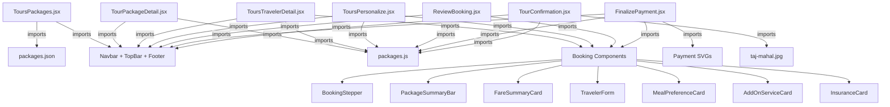

# 🧳 Tour Package Integration - Kya Kya Chahiye?

Agar aapko **sirf Tour Package feature** dusri project mein integrate karna hai, toh Priyanshu ke folder se ye sab files chahiye hongi:

---

## 📦 CATEGORY 1: Tour Pages (ZAROORI — Core Pages)

Ye **7 pages** hain jo Tour Package ka poora flow banate hain:

| # | File | Size | Kya Karta Hai |
|---|------|------|---------------|
| 1 | [ToursPackages.jsx](file:///M:/FLYANYTRIP%20FINAL%20UI/FLYANYTRIP-Ui%20Priyanshu/FLYANYTRIP-UI-/src/pages/ToursPackages.jsx) | 29KB | Tour packages listing page with filters |
| 2 | [TourPackageDetail.jsx](file:///M:/FLYANYTRIP%20FINAL%20UI/FLYANYTRIP-Ui%20Priyanshu/FLYANYTRIP-UI-/src/pages/TourPackageDetail.jsx) | 44KB | Individual package detail page |
| 3 | [ToursTravelerDetail.jsx](file:///M:/FLYANYTRIP%20FINAL%20UI/FLYANYTRIP-Ui%20Priyanshu/FLYANYTRIP-UI-/src/pages/ToursTravelerDetail.jsx) | 19KB | Traveler info form (name, phone, etc.) |
| 4 | [ToursPersonalize.jsx](file:///M:/FLYANYTRIP%20FINAL%20UI/FLYANYTRIP-Ui%20Priyanshu/FLYANYTRIP-UI-/src/pages/ToursPersonalize.jsx) | 9KB | Meal, add-ons, insurance selection |
| 5 | [ReviewBooking.jsx](file:///M:/FLYANYTRIP%20FINAL%20UI/FLYANYTRIP-Ui%20Priyanshu/FLYANYTRIP-UI-/src/pages/ReviewBooking.jsx) | 10KB | Booking review before payment |
| 6 | [FinalizePayment.jsx](file:///M:/FLYANYTRIP%20FINAL%20UI/FLYANYTRIP-Ui%20Priyanshu/FLYANYTRIP-UI-/src/pages/FinalizePayment.jsx) | 28KB | Payment page (UPI, Card, Net Banking) |
| 7 | [TourConfirmation.jsx](file:///M:/FLYANYTRIP%20FINAL%20UI/FLYANYTRIP-Ui%20Priyanshu/FLYANYTRIP-UI-/src/pages/TourConfirmation.jsx) | 17KB | Booking confirmation receipt |

> [!IMPORTANT]
> Ye 7 files Tour ka **complete booking flow** hai:
> `Listing → Detail → Traveler Info → Personalize → Review → Payment → Confirmation`

---

## 📦 CATEGORY 2: Booking Sub-Components (ZAROORI — Used by Pages)

Ye **8 components** Tour pages ke andar import hote hain:

| # | File | Kahan Use Hota Hai |
|---|------|--------------------|
| 1 | [BookingStepper.jsx](file:///M:/FLYANYTRIP%20FINAL%20UI/FLYANYTRIP-Ui%20Priyanshu/FLYANYTRIP-UI-/src/components/booking/BookingStepper.jsx) | Step indicator (Step 1→2→3→4) |
| 2 | [PackageSummaryBar.jsx](file:///M:/FLYANYTRIP%20FINAL%20UI/FLYANYTRIP-Ui%20Priyanshu/FLYANYTRIP-UI-/src/components/booking/PackageSummaryBar.jsx) | Top bar showing selected package |
| 3 | [FareSummaryCard.jsx](file:///M:/FLYANYTRIP%20FINAL%20UI/FLYANYTRIP-Ui%20Priyanshu/FLYANYTRIP-UI-/src/components/booking/FareSummaryCard.jsx) | Price breakdown sidebar |
| 4 | [TravelerForm.jsx](file:///M:/FLYANYTRIP%20FINAL%20UI/FLYANYTRIP-Ui%20Priyanshu/FLYANYTRIP-UI-/src/components/booking/TravelerForm.jsx) | Traveler details input form |
| 5 | [MealPreferenceCard.jsx](file:///M:/FLYANYTRIP%20FINAL%20UI/FLYANYTRIP-Ui%20Priyanshu/FLYANYTRIP-UI-/src/components/booking/MealPreferenceCard.jsx) | Meal selection (Veg/Non-Veg/Jain) |
| 6 | [AddOnServiceCard.jsx](file:///M:/FLYANYTRIP%20FINAL%20UI/FLYANYTRIP-Ui%20Priyanshu/FLYANYTRIP-UI-/src/components/booking/AddOnServiceCard.jsx) | Extra services (photography, etc.) |
| 7 | [InsuranceCard.jsx](file:///M:/FLYANYTRIP%20FINAL%20UI/FLYANYTRIP-Ui%20Priyanshu/FLYANYTRIP-UI-/src/components/booking/InsuranceCard.jsx) | Travel insurance selection |
| 8 | [Stepper.jsx](file:///M:/FLYANYTRIP%20FINAL%20UI/FLYANYTRIP-Ui%20Priyanshu/FLYANYTRIP-UI-/src/components/booking/Stepper.jsx) | Generic stepper component |

> [!WARNING]
> In 8 components ke bina Tour pages **CRASH** karenge! Ye sab copy karna zaroori hai.

---

## 📦 CATEGORY 3: Data Files (ZAROORI — Package Data)

| # | File | Kya Hai |
|---|------|---------|
| 1 | [packages.js](file:///M:/FLYANYTRIP%20FINAL%20UI/FLYANYTRIP-Ui%20Priyanshu/FLYANYTRIP-UI-/src/data/packages.js) | 60KB — All tour packages data (itinerary, pricing, images, etc.) |
| 2 | [packages.json](file:///M:/FLYANYTRIP%20FINAL%20UI/FLYANYTRIP-Ui%20Priyanshu/FLYANYTRIP-UI-/src/data/packages.json) | 3.5KB — Simplified JSON package data (used by listing page) |

> [!NOTE]
> Some pages import `packages.js` and some import `packages.json`. **Dono chahiye!**

---

## 📦 CATEGORY 4: Common/Shared Components (DEPENDS — Agar Target Mein Nahi Hai)

Har Tour page ye 3 common components import karta hai:

| # | File | Kya Hai |
|---|------|---------|
| 1 | [Navbar.jsx](file:///M:/FLYANYTRIP%20FINAL%20UI/FLYANYTRIP-Ui%20Priyanshu/FLYANYTRIP-UI-/src/components/common/Navbar.jsx) | Navigation bar |
| 2 | [TopBar.jsx](file:///M:/FLYANYTRIP%20FINAL%20UI/FLYANYTRIP-Ui%20Priyanshu/FLYANYTRIP-UI-/src/components/common/TopBar.jsx) | Top notification/offer bar |
| 3 | [Footer.jsx](file:///M:/FLYANYTRIP%20FINAL%20UI/FLYANYTRIP-Ui%20Priyanshu/FLYANYTRIP-UI-/src/components/common/Footer.jsx) | Footer section |

> [!TIP]
> Agar target project mein already Navbar/TopBar/Footer hai, toh import paths change karna padega. Nahi hai toh ye 3 bhi copy karo.

---

## 📦 CATEGORY 5: Image Assets (ZAROORI)

### Tour Package Images (for cards & detail pages):
```
public/images/packages/
├── bali-bliss.png          (2.7 MB)
├── golden-triangle.png     (2.3 MB)
├── kerala-backwaters.png   (2.5 MB)
├── ladakh-bike.png         (2.8 MB)
├── rajasthan-royal.png     (2.6 MB)
└── singapore-malaysia.png  (2.6 MB)
```

### Other Images Used by Tour Pages:
```
src/assets/images/taj-mahal.jpg        ← Used by TourConfirmation.jsx
```

### Payment SVGs (Used by FinalizePayment.jsx):
```
src/book now hotel/
├── gpay.svg
├── phonepay.svg
├── paytm.svg
├── bhim.svg
└── QR.svg
```

---

## 📦 CATEGORY 6: Routes (App.jsx mein add karna padega)

Target project ke `App.jsx` mein ye routes add karo:

```jsx
// Tour Packages Routes
import ToursPackages from './pages/ToursPackages'
import TourPackageDetail from './pages/TourPackageDetail'
import ToursTravelerDetail from './pages/ToursTravelerDetail'
import ToursPersonalize from './pages/ToursPersonalize'
import ReviewBooking from './pages/ReviewBooking'
import FinalizePayment from './pages/FinalizePayment'
import TourConfirmation from './pages/TourConfirmation'

// Inside <Routes>:
<Route path="/tour-packages" element={<ToursPackages />} />
<Route path="/tour-packages/:id" element={<TourPackageDetail />} />
<Route path="/tour-packages/:id/book" element={<ToursTravelerDetail />} />
<Route path="/tour-packages/:id/book/personalize" element={<ToursPersonalize />} />
<Route path="/tour-packages/:id/book/review" element={<ReviewBooking />} />
<Route path="/tour-packages/:id/book/payment" element={<FinalizePayment />} />
<Route path="/tour-packages/:id/book/confirmation" element={<TourConfirmation />} />
```

---

## 📦 CATEGORY 7: Dependencies (package.json check karo)

Target project mein ye packages installed hone chahiye:

| Package | Version | Kyun |
|---------|---------|------|
| `lucide-react` | ^1.24.0 | Icons (MapPin, Heart, Star, etc.) |
| `react-router-dom` | ^7.18.1 | Routing & navigation |
| `framer-motion` | ^12.42.2 | Animations (agar use ho rahi ho) |
| `tailwindcss` | ^3.4.19 | All styling is Tailwind-based |
| `jspdf` | ^4.2.1 | PDF download (confirmation page) |
| `dom-to-image-more` | ^3.10.2 | Screenshot for PDF |

---

## 📊 Summary — Total Files Needed

| Category | Files Count | Zaroori? |
|----------|-------------|----------|
| Tour Pages | **7** | ✅ MUST COPY |
| Booking Components | **8** | ✅ MUST COPY |
| Data Files | **2** | ✅ MUST COPY |
| Common Components | **3** | ⚠️ IF NOT ALREADY IN TARGET |
| Package Images | **6** | ✅ MUST COPY |
| Other Images | **1** (taj-mahal) | ✅ MUST COPY |
| Payment SVGs | **5** | ✅ MUST COPY |
| **TOTAL** | **~32 files** | |

---

## 🔄 Dependency Map (Kaun Kisse Depend Karta Hai)



> [!CAUTION]
> Agar koi bhi dependency file miss ho gayi toh page **white screen / crash** dega. Sab files copy karna zaroori hai!
